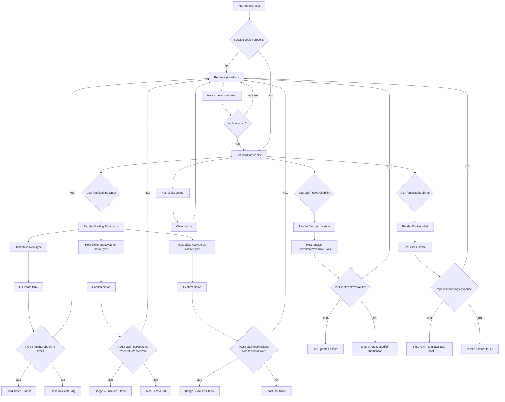

# Current Host Flow (Calendai)

## Overview

The single authenticated **Host** signs in, manages their **Availability** by
opening and closing **Slots**, and views and cancels **Bookings**. There is
exactly one Host; every `/api/host/*` endpoint requires authentication.

- All times are **UTC** (ADR-0002).
- The **Host horizon** is the current week + 4 (Monday-anchored, rolling)
  (ADR-0001).
- A **Slot** is fixed at 15 minutes, aligned to `:00/:15/:30/:45`.

> **Auth note (contract mismatch).** This flow describes a **cookie-based**
> session: on sign-in the Host's credential is stored in an
> `HttpOnly; Secure; SameSite=Strict` cookie, which the browser then attaches
> automatically to every `/api/host/*` request. A cookie of this kind is not
> readable by JS, which keeps the credential out of reach of XSS.
>
> However, the API contract (`main.tsp`) currently declares
> `@useAuth(BearerAuth)` — an `Authorization: Bearer` header — and
> `src/api/client.ts` sends that header from a token held in JS. Because the API
> is **mocked by Prism** (which does not validate auth), this document records
> cookie auth as the **intended** model and marks aligning the contract and
> client as a **follow-up**. No `main.tsp` change and no ADR are made here.

---

## Step-by-Step Flow

### 1. Host Entry (`/host`)

**Component:** `HostPage.tsx` (reached via the "Host" link in `Layout.tsx`)

| Step | Action      | UI / API                                             |
|------|-------------|------------------------------------------------------|
| 1.1  | Page loads  | Check for an existing session cookie                 |
| 1.2  | No session  | Render the sign-in form (§2)                         |
| 1.3  | Has session | Render the Host dashboard and load data (§3, §4, §5) |

---

### 2. Sign In

| Step | Action        | UI / API                                                                                    |
|------|---------------|---------------------------------------------------------------------------------------------|
| 2.1  | Host sees     | Sign-in form (credential field + "Sign in")                                                 |
| 2.2  | Host submits  | Credential exchanged for a session, stored in an `HttpOnly; Secure; SameSite=Strict` cookie |
| 2.3  | Success       | Cookie set; dashboard renders; `/api/host/*` calls carry the cookie                         |
| 2.4  | Failure       | `401 Unauthorized` → stay on sign-in form, show "Invalid or expired session"                |
| 2.5  | Host logs out | Cookie cleared → return to sign-in form                                                     |

**Session expiry:** any `/api/host/*` call returning `401` drops the Host back to
the sign-in form ("Session expired — please sign in again").

---

### 3. Manage Slots (Availability)

| Step | Action          | UI / API                                                                                                    |
|------|-----------------|-------------------------------------------------------------------------------------------------------------|
| 3.1  | Dashboard loads | `GET /api/host/availability` → `HostSlot[]` (Host horizon: current week + 4); also loads Booking Types (§5) |
| 3.2  | Host sees       | A 15-minute Slot grid grouped by day, each Slot showing its `state`                                         |
| 3.3  | Host clicks     | An `unavailable` Slot → stage it to `available` (open)                                                      |
| 3.4  | Host clicks     | An `available` Slot → stage it to `unavailable` (close)                                                     |
| 3.5  | Booked Slot     | A `booked` Slot is **not** editable here — must cancel its Booking first (§4)                               |
| 3.6  | Host submits    | `PUT /api/host/availability` with `AvailabilityEdit[]` → updated `HostSlot[]`                               |
| 3.7  | Success         | Grid reflects the new states; toast "Availability updated"                                                  |
| 3.8  | Error           | `422 Unprocessable` (edited a booked Slot, off-grid, or beyond horizon) → toast error                       |

**Slot states (`SlotState`):**

- `unavailable` — default; not opened by the Host.
- `available` — opened for booking, not yet booked.
- `booked` — occupied by a Booking.

**Empty state:** no Slots opened yet → "No open Slots. Click a Slot to open it
for booking."

---

### 4. View & Cancel Bookings

| Step | Action          | UI / API                                                                |
|------|-----------------|-------------------------------------------------------------------------|
| 4.1  | Dashboard loads | `GET /api/host/bookings` → `Booking[]`                                  |
| 4.2  | Host sees       | List of Bookings (Visitor name, email, Booking Type, start Slot in UTC) |
| 4.3  | Host clicks     | "Cancel" on a Booking                                                   |
| 4.4  | Host confirms   | `POST /api/host/bookings/{id}/cancel` → `204 No Content`                |
| 4.5  | Success         | Booking removed from the list; toast "Booking cancelled"                |
| 4.6  | Error           | `404 Not Found` (unknown Booking) / `401 Unauthorized` → toast error    |

**Cancel side-effect (domain rule):** when a Booking is cancelled, its Slots
return to **`unavailable`** — *not* `available`. The Host must explicitly re-open
them in §3 to make them bookable again.

---

### 5. Manage Booking Types

The **Booking Types** section appears at the top of the dashboard (above
Availability). It lists all Booking Types (active and inactive) and lets the
Host create new ones or deactivate old ones.

| Step | Action                                     | UI / API                                                                                                                            |
|------|--------------------------------------------|-------------------------------------------------------------------------------------------------------------------------------------|
| 5.1  | Dashboard loads                            | `GET /api/booking-types` → `BookingType[]` (all types, active + inactive)                                                           |
| 5.2  | Host sees                                  | Cards for each Booking Type showing title, description, duration (`durationSlots × 15 min`), and an **Active** / **Inactive** badge |
| 5.3  | Host clicks "New Type"                     | Opens an inline or modal **create form** with fields: slug, title, description, durationSlots                                       |
| 5.4  | Host fills & submits                       | `POST /api/host/booking-types` with `CreateBookingType` body                                                                        |
| 5.5  | Success                                    | Card added to the grid; toast "Booking Type created"                                                                                |
| 5.6  | Duplicate slug                             | `422 Unprocessable` → toast "Slug already exists"                                                                                   |
| 5.7  | Host clicks "Deactivate" on an active type | Confirmation dialog → `POST /api/host/booking-types/{slug}/deactivate`                                                              |
| 5.8  | Success                                    | Card badge flips to **Inactive**; toast "Booking Type deactivated"                                                                  |
| 5.9  | Host clicks "Activate" on an inactive type | Confirmation dialog → `POST /api/host/booking-types/{slug}/activate`                                                                |
| 5.10 | Success                                    | Card badge flips to **Active**; toast "Booking Type activated"                                                                      |
| 5.11 | Not found                                  | `404 Not Found` → toast error                                                                                                       |

**Key rules:**

- **Slug** and **durationSlots** are immutable after creation.
- Deactivation is **soft** — `active = false`. Activation sets `active = true`.
  The record is retained and existing Bookings referencing it remain valid.
- Only **title** and **description** can be edited after creation (via
  `PATCH /api/host/booking-types/{slug}`); this is a future enhancement not yet
  exposed in the UI.
- Deactivated Booking Types are hidden from the Visitor flow but still visible
  to the Host.
- An inactive type that has no future Bookings can be safely activated again to
  resume accepting new Bookings.

---

## Domain Rules Enforced

| Rule                               | Where Enforced                                                                                |
|------------------------------------|-----------------------------------------------------------------------------------------------|
| **UTC only**                       | `formatTime`/`formatDate` in `utils.ts` use `timeZone: 'UTC'`                                 |
| **15-min Slots**                   | Slot grid aligned to `:00/:15/:30/:45`                                                        |
| **Host horizon**                   | `GET /api/host/availability` returns only Slots within current week + 4 (server-side)         |
| **Slot states**                    | `HostSlot.state` is `unavailable` \| `available` \| `booked`                                  |
| **Booked Slots immutable**         | `PUT /api/host/availability` rejects editing a `booked` Slot (`422`)                          |
| **Cancel → `unavailable`**         | Cancelled Booking's Slots return to `unavailable`, not `available` (server-side)              |
| **Booking ID format**              | `YYYY-MM-DD-HH-MM` (UTC) derived from `startSlot`                                             |
| **Single Host auth**               | All `/api/host/*` endpoints require authentication; `401` otherwise                           |
| **Slug & durationSlots immutable** | Slug and `durationSlots` cannot be changed after creation (server-side)                       |
| **Deactivation is soft**           | Deactivation sets `active = false`; the record is retained and existing Bookings remain valid |

---

## API Endpoints Used (Host)

| Method | Path                                        | Request              | Response            |
|--------|---------------------------------------------|----------------------|---------------------|
| GET    | `/api/host/availability`                    | —                    | `HostSlot[]`        |
| PUT    | `/api/host/availability`                    | `AvailabilityEdit[]` | `HostSlot[]`        |
| GET    | `/api/host/bookings`                        | —                    | `Booking[]`         |
| POST   | `/api/host/bookings/{id}/cancel`            | —                    | `204`               |
| POST   | `/api/host/booking-types`                   | `CreateBookingType`  | `201 + BookingType` |
| POST   | `/api/host/booking-types/{slug}/deactivate` | —                    | `BookingType`       |
| POST   | `/api/host/booking-types/{slug}/activate`   | —                    | `BookingType`       |
| PATCH  | `/api/host/booking-types/{slug}`            | `UpdateBookingType`  | `BookingType`       |

All Host endpoints require authentication (see the Auth note above).

---

## Mermaid Diagram

